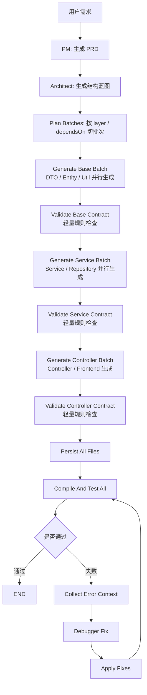

## Trae 优化：

#### 主要修改点：

1. 拆分 Agent (TesterAgent -> DebuggerAgent & TestWriterAgent)

- 将原本的 TesterAgent 文件重命名并重构为了 DebuggerAgent ，现在它专门负责分析错误日志和进行代码修复，并在错误发生时触发。
- 新增了 TestWriterAgent ，其职责设定为基于 PRD、项目结构及现有的源代码直接生成对应的 JUnit 测试类，并设定其在 DeveloperAgent 编写完所有核心业务代码后触发。
- 为了让 TestWriterAgent 能够成功返回多个测试代码文件，我新增了 TestClassesResult 这个 POJO 对象用于承载测试结果。
2. 优化架构师 Agent 设定

- 修改了 ArchitectAgent 的 prompt：明确指示其 不再生成任何测试类 (DO NOT include any test files) 。这样能避免之前架构师过早要求开发者生成测试用例的问题，彻底将测试类的生成任务交给后期的 TestWriterAgent 负责。
3. 重构生成流水线 (generateProject)

- 修改了 SoftwareStudioServiceImpl ，更新了依赖注入逻辑（去掉了 TesterAgent，引入了 TestWriterAgent 和 DebuggerAgent）。
- 在生成流水线中进行了调整：
  1. 产品经理（PM）产出 PRD。
  2. 架构师（Architect）根据需求输出业务类的蓝图（不包含测试）。
  3. 工程师（Developer）遍历蓝图循环生成出所有的业务代码（生成过程中能感知到已生成的业务类上下文）。
  4. (新增) 测试工程师（TestWriterAgent）在上述代码均编写完成后，统揽全局代码与 PRD ，生成针对性的 JUnit 测试类，追加到代码集合中。
  5. 文件写入磁盘。
  6. 开启沙箱进行循环运行和测试，测试失败则呼叫 DebuggerAgent 修复代码，修复成功后进行下一轮。
4. 相关配置与测试类的同步修复

- 在 AiConfig 中完成了两个新 Agent Bean 的注册。
- 同步替换了 CodeFixTest 等其他引用了旧 TesterAgent 的代码，统一使用 DebuggerAgent 来替代，并且确保了代码可以成功编译。

## Codex 优化

### LangGraph 重构后的流程优化（4.13）

#### 大体架构介绍

**重构目标**
这次重构建议围绕一个原则展开：**LangGraph 负责“组织生成流程”，不是频繁触发昂贵修复**。
也就是把图主要用在：

- 分层生成
- 层内并行
- 轻量校验
- 最终统一编译、测试、修复

这样既能让图“像图”，也能控制 token 消耗。

**目标图**

已经按这条思路重构好了，主流程现在是“按批次生成 + 中间轻校验 + 最后统一编译/测试/修复”。

**这次改了什么**

- 新增了一个真正以图状态驱动的主服务 BatchGraphSoftwareStudioService.java (line 39)，并标成 @Primary。现在流程是 pm -> architect -> plan_batches -> generate_batch -> validate_batch -> generate_tests -> persist -> run -> evaluate -> fix。
- 批次规划抽到了 BatchPlanningService.java (line 21)，会按 layer/batchName/dependsOn 组织生成顺序，并在批次内做依赖排序。
- 中间的低成本结构检查抽到了 ContractValidationService.java (line 16)，现在不会每个阶段都进 debugger，只做 package/type/注解/占位符这类轻量检查。
- 文件蓝图扩成了批次友好的结构 FileBlueprint.java (line 7)，新增了 layer、batchName、dependsOn，并补了 targetPath()/effectiveLayer()。
- 开发 Agent 的输入也升级了，DeveloperAgent.java (line 46) 现在会收到“当前批次上下文”，并按完整目标路径生成文件。
- 老的 SoftwareStudioServiceImpl.java (line 184) 只做了最小兼容修改，方便你保留备份思路。

**验证**

- mvn -q -DskipTests compile 已通过。
- 我顺手修掉了两个 BOM 编码问题，不然 Java 编译器会直接报非法字符。
- 我没有继续跑完整 mvn test，因为你项目里原本那套测试仍然依赖外部 AI key / Docker 环境，这一块这次没有一起拆。

**现在这个分支的收益**

- LangGraph 不再只是包一层串行逻辑了，批次推进和条件边已经真正用起来。
- token 成本比“每层都编译修复”低很多。
- 同层文件现在可以并发生成，但真正昂贵的修复只放到最后统一做。
- 架构输出终于能表达“先生成什么、后生成什么”。

如果你愿意，我下一步可以继续帮你做两件很值的后续优化之一：

1. 把 ArchitectAgent 的 prompt 和输出约束再收紧，让 layer/dependsOn 更稳定。
2. 把现有测试拆成 manual integration 和 unit 两层，让 mvn test 也能正常自动跑。

#### 你讲一下你是怎么迁移框架和做优化的？

这次我做的不是“简单换个框架名”，而是把原来基于 langchain4j AiServices 的线性调用链，升级成了基于 langgraph4j 的有状态工作流。底层模型接入我其实还保留了 langchain4j 的 ChatLanguageModel 能力，主要迁移的是上层编排方式，因为我们这个场景本质上不是单轮问答，而是一个多阶段、可回退、可修复的 agent workflow。

旧版本的核心流程是 PM -> Architect -> Developer 逐文件生成 -> TestWriter -> Docker 运行 -> while 循环修复。这个方案能跑，但有几个明显问题：第一，所有状态都揉在一个大方法里，流程分支和重试逻辑比较重；第二，代码生成是按文件串行推进，后面的文件要带上前面越来越长的 existingCode，上下文会不断膨胀；第三，修复流程主要靠 while + if/else 驱动，后面如果要插入新节点或者增加判断条件，维护成本会越来越高。

所以我迁移时做了两件核心事。

**第一件** 是把流程显式拆成图节点，比如 pm、architect、plan_batches、generate_batch、validate_batch、generate_tests、persist、run、evaluate、fix，中间通过统一的 WorkflowData 传状态，里面会保存 PRD、架构、批次计划、当前批次下标、代码结果、校验 warning、运行结果、重试次数这些信息。这样分支不再散落在大方法里，而是通过图上的 conditional edge 来控制，比如校验完决定继续下一个 batch，还是进入测试；运行评估后决定结束还是进入 fix。

**第二件** 是对代码生成链路做优化。以前是“按文件一个一个生成”，我现在先做 BatchPlanning，按 layer 和依赖关系把文件拆成 batch，比如基础层、service 层、controller 层、frontend 层，再在 batch 内部按依赖排序。同一个 batch 里能并发的文件就并发生成，这样既保证依赖顺序，又能降低整体耗时。batch 生成完之后，我没有立刻进 Docker，而是先做一层轻量 contract validation，检查 package 和路径是否一致、public type 名字是否匹配、controller/service 注解是否缺失、代码里有没有 TODO 或 placeholder。这一步能提前拦住很多低级错误，减少无效沙箱运行。

另外，修复链路我也做了收敛。不是把全量代码无脑丢给 Debugger，而是结合错误日志提取最相关的文件，其他文件只给摘要；同时把前面轻量校验发现的 warning 一起带进去。这样一方面减少 token，另一方面让修复更聚焦，避免模型在大上下文里“修偏”。

如果你想用一段更口语化、1 分钟左右的回答，可以直接说：

“我这次迁移的重点其实不是把模型调用从 A 库换到 B 库，而是把整个多 Agent 代码生成流程从线性链路重构成了有状态图。旧版是 PM、架构师、开发、测试、修复串行往下走，状态都堆在一个大方法里，后期上下文越来越长，修复逻辑也比较难扩展。新版我用 langgraph4j 把它拆成多个节点，用统一状态对象在节点间流转，再通过条件边控制下一步是继续生成、进入测试还是进入修复。与此同时，我新增了 batch planning，把文件按层和依赖拆批次，同批次内并发生成；再加一层轻量 contract validation，提前检查 package、类型名、注解、占位代码这些问题。这样整体效果是链路更清晰、扩展性更好、生成速度更快，而且无效重试更少。”

如果面试官继续追问“为什么一定要迁移到 langgraph4j”，你就补一句：

“因为这个场景的核心难点不是 prompt 本身，而是 workflow orchestration。只用线性链路，流程一复杂就会出现状态分散、分支难维护、重试逻辑膨胀的问题；而 graph 模型天然更适合表达多阶段、多分支、可修复的 agent 系统。”

#### 你是怎么设计这些节点的？每个节点的功能是什么？

#### 节点之间共享了哪些内容，又是通过什么判断是否能够传到下一个节点的？

你这块其实可以从“为什么这样拆节点”开始讲，再讲“每个节点干什么”，最后讲“状态怎么共享、边怎么判断”。这样逻辑最完整。

你可以这样回答：

我在迁移到 `langgraph4j` 之后，核心思路是把原来一个大方法里的顺序流程，拆成“显式节点 + 显式状态 + 显式路由”。因为代码生成这个场景不是单轮调用，而是一个多阶段、多分支、会失败重试的工作流。如果还用原来那种大 `generateProjectInternal()` 方法去写，业务一复杂，状态和分支就会越堆越乱。所以我把它建模成一个图，每个节点只负责一类职责，节点之间不直接传很多零散参数，而是统一读写一个共享状态对象 `WorkflowData`。

##### **节点怎么设计的**

我把整个链路拆成了 10 个节点：

1. `pm`
2. `architect`
3. `plan_batches`
4. `generate_batch`
5. `validate_batch`
6. `generate_tests`
7. `persist`
8. `run`
9. `evaluate`
10. `fix`

这样拆的原则有三个。

第一，按职责边界拆。需求分析、架构设计、代码生成、校验、测试生成、落盘、运行验证、错误修复，这些本来就是不同阶段，天然适合独立成节点。

第二，按“是否可能成为分支点”拆。比如 `validate_batch` 后面就要判断是继续下一个 batch 还是进入测试；`evaluate` 后面要判断是结束还是进入修复。所以这些位置必须独立成节点，不能和前后逻辑揉在一起。

第三，按“是否需要独立演进”拆。像 `plan_batches`、`validate_batch` 这种其实是我这次优化新增的能力，后面如果我要换更复杂的批次策略、或者把轻量校验升级成 AST 校验，都只需要替换局部节点，不会把整个链路推翻。

##### **每个节点的功能是什么**

`pm` 节点负责把用户输入转换成结构化 PRD。  
它只做一件事，就是调用产品经理 Agent，把自然语言需求整理成项目名、功能范围、用户故事、技术方向这些更结构化的信息。它的输出是 `prd`，后面所有节点都会依赖它。

`architect` 节点负责从 PRD 生成项目结构蓝图。  
它会产出 `ProjectStructure`，里面最核心的是文件清单，也就是有哪些文件、每个文件的职责、项目类型、主类名这些。这个节点相当于把“做什么项目”进一步落成“要生成哪些文件”。

`plan_batches` 节点负责做批次规划。  
这是我这次优化里很关键的一步。旧版是直接遍历所有文件逐个生成，新版会先根据 `ProjectStructure` 做 `GenerationPlan`，把文件按 layer 和依赖关系切成多个 `GenerationBatch`。比如基础层可能先生成，service/controller/front-end 往后排。如果同一批次里的文件没有强依赖，就可以并发生成。这个节点的输出是 `generationPlan` 和 `currentBatchIndex=0`。

`generate_batch` 节点负责生成当前批次的代码。  
它不会一次生成整个项目，而是只处理 `currentBatch()` 对应的那一批文件。每个文件仍然是 Developer Agent 单文件生成，但这一层相比旧版有两个改进：  
一是范围被限制在当前 batch，避免全局串行；  
二是同一批次内部可以并发，用 `CompletableFuture` 去发起生成。  
这个节点的产出会更新到 `codes` 里。

`validate_batch` 节点负责轻量契约校验。  
这一步不是跑 Docker，也不是编译项目，而是做一层低成本检查，尽量提前发现明显问题。我从当前实现里看到它主要检查这些内容：

- 生成文件是否和蓝图文件能对上
- `package` 声明是否存在、是否和路径匹配
- public 类型名是否和文件名匹配
- controller 层文件是否缺少 `@RestController` / `@Controller`
- service 层文件是否缺少 `@Service`
- 代码里是否还有 `TODO`、`implement logic`、`placeholder`

它把问题记录到 `validationWarnings`，但这里是“warning”而不是直接中断，因为我希望它是一个轻量过滤器，先降低明显低质代码进入后续链路的概率。

`generate_tests` 节点负责在所有生产代码完成后统一生成测试。  
这里我没有在每个 batch 后都生成测试，而是等所有生产代码批次结束后统一生成。原因是测试通常需要更完整的全局上下文，如果太早生成，容易出现测试和最终代码不一致的问题。它会把测试文件继续追加进 `codes`。

`persist` 节点负责把当前内存态代码落盘。  
它会调用 `WorkspaceService` 把 `codes` 写到项目目录，并把路径保存到 `projectPath`。这一步单独拆出来的好处是，前面所有节点都可以只操作内存状态，直到准备运行时才真正写盘。

`run` 节点负责把项目送进沙箱执行。  
这里会基于 `projectPath`、`projectType`、`mainClassName` 去 Docker 沙箱里跑编译/启动/执行，并把结果放进 `executionResult`。这个节点只负责“执行”，不负责判断结果。

`evaluate` 节点负责判断当前是否成功。  
这是另一个关键分支点。它会看运行结果有没有异常，如果没有异常，再继续跑测试，把结果存到 `testResult`。然后根据日志判断：

- 如果编译和运行没问题，测试也通过，就把 `success=true`
- 如果运行失败，或者测试失败，就设置 `shouldFix=true`
- 同时把待修复日志写进 `pendingFixLog`
- 把错误类型写进 `pendingErrorType`
- 控制是否继续重试

也就是说，这个节点不负责修，它只负责做 outcome decision。

`fix` 节点负责修复。  
当 `evaluate` 判断需要修复时，就进入这里。它会把 `pendingFixLog`、`pendingErrorType`、当前代码上下文、以及前面轻量校验产生的 `validationWarnings` 一起组织后发给 Debugger Agent。修复结果返回后，会：

- 规范化修复文件名
- 更新内存中的 `codes`
- 同步写回磁盘
- `currentAttempt++`

修完以后不是结束，而是重新回到 `run` 节点，再次验证，形成一个闭环。

##### **节点之间共享了哪些内容**

这些节点之间不是靠一个个参数硬传，而是共享一个 `WorkflowData`。  
从当前实现里看，这个对象大概包含这些字段：

- `userRequest`
- `maxRetries`
- `codes`
- `validationWarnings`
- `prd`
- `structure`
- `generationPlan`
- `currentBatchIndex`
- `projectPath`
- `executionResult`
- `testResult`
- `pendingFixLog`
- `pendingErrorType`
- `success`
- `shouldFix`
- `currentAttempt`

你可以把它理解成“整个工作流的上下文内存”。

其中最关键的几类状态是：

第一类是需求与设计状态。  
也就是 `userRequest`、`prd`、`structure`。前两步节点产出这些内容，后面的生成、测试、修复都会依赖它们。

第二类是生成状态。  
也就是 `generationPlan`、`currentBatchIndex`、`codes`。这决定现在生成到哪一批、已经有哪些代码产出。

第三类是执行状态。  
也就是 `projectPath`、`executionResult`、`testResult`。这些是运行验证阶段的核心输入。

第四类是控制状态。  
也就是 `success`、`shouldFix`、`currentAttempt`、`maxRetries`。这些字段决定工作流是否结束、是否修复、是否还能继续重试。

第五类是修复辅助状态。  
也就是 `pendingFixLog`、`pendingErrorType`、`validationWarnings`。这些内容帮助 Debugger Agent 更精确地修，而不是盲修。

##### **节点之间是怎么判断能不能传到下一个节点的**

这里要分两类边。

一类是固定边，也就是顺序必经节点。  
比如：

- `START -> pm`
- `pm -> architect`
- `architect -> plan_batches`
- `plan_batches -> generate_batch`
- `generate_batch -> validate_batch`
- `generate_tests -> persist`
- `persist -> run`
- `run -> evaluate`
- `fix -> run`

这些地方没有争议，因为业务上就是固定顺序。

另一类是条件边，也就是图里真正体现 `langgraph4j` 价值的地方。当前这版主要有两个条件判断。

第一个条件判断发生在 `validate_batch` 之后。  
这里不是总去 `generate_tests`，而是要先看还有没有下一批。它依赖 `WorkflowData.hasMoreBatches()`。如果还有 batch，就走：

- `validate_batch -> generate_batch`

如果没有 batch 了，就走：

- `validate_batch -> generate_tests`

也就是说，这里的判断本质上是“生产代码是否已经全部生成完”。

第二个条件判断发生在 `evaluate` 之后。  
这里会看 `shouldFix`。如果是 `true`，说明这轮运行或测试没通过，进入：

- `evaluate -> fix`

如果是 `false`，说明已经达到成功条件，进入：

- `evaluate -> END`

也就是说，这里的判断本质上是“当前结果是否已经足够好，可以结束”。

你还可以补一句更深入的话：

其实 `run` 和 `evaluate` 是我故意拆开的，因为执行和决策是两回事。`run` 负责拿事实，`evaluate` 负责根据事实改写控制状态，再由条件边决定是否进入 `fix`。这样图的语义更清晰，也更符合状态机思路。

##### **为什么这种设计比原来更好**

你最后可以总结成三点。

第一，可维护性更好。  
以前一个大方法里把生成、测试、修复、重试全写在一起，后面要插入新能力会很痛。现在每个节点职责单一，修改局部逻辑不会影响整张图。

第二，可扩展性更好。  
比如以后你要加一个“安全扫描节点”或者“代码评分节点”，直接插在 `validate_batch` 和 `generate_tests` 之间就行，不需要重写主流程。

第三，性能和质量都更好。  
批次规划让生成可以部分并发，轻量校验减少明显错误流入沙箱，修复上下文更聚焦，整体上就是更快、更稳、无效重试更少。

如果你想，我下一条可以直接帮你整理成一版“面试口语稿”，用 2 分钟把“节点设计 + 状态共享 + 条件流转”顺下来讲。

